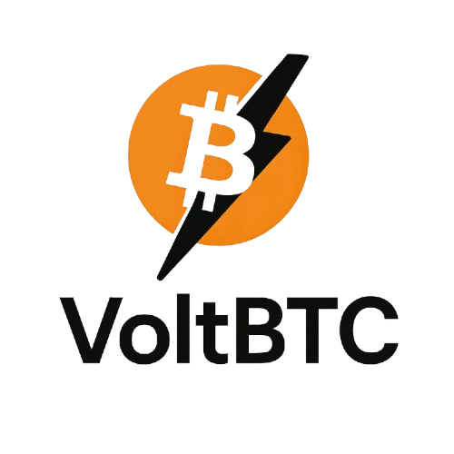

<!-- BANNER -->
<p align="center">
  
</p>

<h1 align="center">⚡ VoltBTC – Modular BTC Finance on Starknet ⚡</h1>

<p align="center">
  <b>Grow your Bitcoin (WBTC) safely, automatically, and transparently with next-gen DeFi vaults, bonds, and strategies.</b>
</p>

<p align="center">
  <a href="#features">✨ Features</a> • <a href="#quick-start">🚀 Quick Start</a> • <a href="#architecture">🛠 Architecture</a> • <a href="#workflow">🔄 Workflow</a> • <a href="#how-to-use">📝 How to Use</a> • <a href="#faq">❓ FAQ</a>
</p>

---

## 🌟 What is VoltBTC?
VoltBTC is a modular DeFi platform built on Starknet (Ethereum Layer 2) that helps you grow your Bitcoin (WBTC) with automated vaults, fixed-term bonds, strategy sharing, forecasting tools, and built-in DeFi education. It’s designed for everyone—from total beginners to DeFi pros.

---

## 🏆 Unique Selling Points (USP)
- **BTC-First**: Focused on Bitcoin and WBTC yield generation.
- **Automation**: Auto-rebalancing vaults optimize returns for you.
- **Transparency**: All strategies and returns are visible and auditable.
- **Education**: Built-in learning section for DeFi beginners.
- **Composability**: Create, share, and follow custom strategies.

---

## ✨ Features
- **Vaults**: Deposit WBTC, earn yield via automated or manual strategies.
- **Bonds**: Lock BTC for fixed terms (7, 30, 90 days) for extra yield.
- **Marketplace**: Discover, follow, and copy community strategies.
- **Forecasting**: Simulate and compare potential returns.
- **History**: Track all your deposits, withdrawals, and actions.
- **DeFi Learning**: Simple guides and explanations for new users.

---

## 📦 Project Structure
- **apps/contracts/** — Cairo smart contracts for Starknet (BTC vault, rBTC, etc.)
- **apps/webapp/** — Next.js 15 frontend for interacting with the contracts
- **Root** — Monorepo configs, shared dependencies, and documentation

---

## 🚀 Quick Start

### 1. Clone the Repository
```sh
git clone <your-repo-url>
cd VoltBTC
```

### 2. Install Dependencies
- For the frontend:
  ```sh
  cd apps/webapp
  bun install # or pnpm install or npm install
  ```
- For contracts:
  ```sh
  cd apps/contracts
  scarb build
  ```

### 3. Deploy Smart Contracts (Starknet Sepolia)
- Make sure you have a funded Starknet account (e.g., Braavos/ArgentX on Sepolia)
- Build contracts:
  ```sh
  scarb build
  ```
- Deploy using [starkli](https://github.com/xJonathanLEI/starkli):
  ```sh
  starkli deploy --account <YOUR_ACCOUNT_ADDRESS> --rpc <SEPOLIA_RPC_URL> target/dev/btc_vault.sierra.json
  starkli deploy --account <YOUR_ACCOUNT_ADDRESS> --rpc <SEPOLIA_RPC_URL> target/dev/rbBTC.sierra.json
  ```
- Copy the contract addresses.

### 4. Configure the Frontend
- In `apps/webapp/.env`, set:
  ```env
  NEXT_PUBLIC_BTC_VAULT_ADDRESS=0x...
  NEXT_PUBLIC_rBTC_ADDRESS=0x...
  ```

### 5. Run the Frontend
```sh
cd apps/webapp
bun dev # or pnpm dev or npm run dev
```
Visit [http://localhost:3000](http://localhost:3000) in your browser.

---

## 🛠 Architecture

- **Smart Contracts**: Written in Cairo, deployed on Starknet Sepolia.
- **Frontend**: Next.js 15 (React), TailwindCSS, shadcn/ui.
- **Wallets**: Starknet wallets (Braavos, ArgentX) for user authentication and transactions.
- **Backend/DB**: Uses Supabase for user data and real-time sync.
- **APIs**: Integrates with Pragma (oracle), Vesu, Ekubo, and GraphQL endpoints.

### ASCII Architecture Diagram
```
+-------------------+
|   User Wallet     |
+--------+----------+
         |
         v
+-------------------+
|   Next.js Frontend|
+--------+----------+
         |
         v
+-------------------+
|  API Integrations |
| (Pragma, Vesu,    |
|  Ekubo, Supabase) |
+--------+----------+
         |
         v
+-------------------+
|  Starknet Smart   |
|    Contracts      |
+-------------------+
```

---

## 🔄 Workflow & User Journey
1. **Connect Wallet**: Use Braavos or ArgentX (Sepolia testnet).
2. **Deposit WBTC**: Add WBTC to the vault.
3. **Choose a Strategy**: Let the app pick, or choose your own.
4. **Earn Yield**: Vaults allocate funds for you.
5. **Track Growth**: See your balance and earnings in real time.
6. **Withdraw Anytime**: Take your WBTC out whenever you want.
7. **Try Bonds**: Lock BTC for higher, fixed returns.
8. **Learn and Explore**: Use the Learn section for DeFi guides.

---

## 📝 How to Use VoltBTC (A-Z)
A. **Open the Website**: Go to the VoltBTC site in your browser.
B. **Connect Wallet**: Click 'Connect Wallet' and use Braavos or ArgentX (on Sepolia testnet).
C. **Deposit**: Go to 'Deposit', enter how much WBTC you want to add, and confirm in your wallet.
D. **Pick a Strategy**: Let the app choose, or pick your own from the marketplace.
E. **Watch Your BTC Grow**: Check the dashboard for your balance and earnings.
F. **Try Bonds**: Lock BTC for a set time for higher returns.
G. **Forecast**: Use the forecast tool to see possible future earnings.
H. **Withdraw**: Go to 'Withdraw', enter the amount, and confirm in your wallet.
I. **Check History**: See all your actions in the 'History' section.
J. **Learn**: Visit 'Learn' for easy guides and explanations.
K. **Get Help**: If you’re stuck, check the guides or ask for help.

---

## 💡 What is DeFi? What is WBTC? What is a Vault?
- **DeFi**: Decentralized Finance—financial services without banks, powered by smart contracts.
- **WBTC**: Wrapped Bitcoin—a version of Bitcoin that works on Ethereum and Starknet. 1 WBTC = 1 BTC.
- **Vault**: An automated smart contract that manages your WBTC to earn more, safely and transparently.

---

## 🎯 Use Cases
- **Passive Saver**: Deposit BTC and let the app do the work.
- **Active Investor**: Try different strategies, bonds, or create your own.
- **Learner**: Use the app to learn about DeFi and Bitcoin safely.
- **Community Member**: Share strategies and help others.

---

## 📊 Performance & Security
| Metric                    | Expected/Observed Result                |
|---------------------------|-----------------------------------------|
| Transaction Fee           | <$0.10 (Starknet L2)                   |
| Confirmation Time         | Seconds to a few minutes                |
| Typical Vault Yield (APY) | 2–10% (variable, market-dependent)      |
| Bond Yield (APY)          | 5–15% (fixed, term-dependent)           |
| Time to First Yield       | Minutes after deposit                   |
| Withdrawal Latency        | Minutes (depends on network)            |
| User Control              | 100% non-custodial                      |
| Security                  | Open-source, auditable smart contracts  |
| Scalability               | High (Starknet L2)                      |
| Education                 | Built-in guides, lowers user error      |

---

## 🧑‍💻 Contributing
Pull requests and issues are welcome!

---

## 📚 FAQ
**Q: Is VoltBTC safe?**
A: All smart contracts are open-source and auditable. You always control your funds.

**Q: Do I need to know DeFi to use VoltBTC?**
A: No! The app is designed for beginners, with built-in guides and simple steps.

**Q: Can I lose my BTC?**
A: Your BTC is always in your control, but as with all DeFi, there are risks. Start small and use the Learn section.

**Q: What wallets can I use?**
A: Braavos and ArgentX (Starknet wallets) are supported.

---

## 📝 License
MIT

---

<p align="center">
  <b>Enjoy your DeFi journey with VoltBTC! 🚀</b>
</p>
